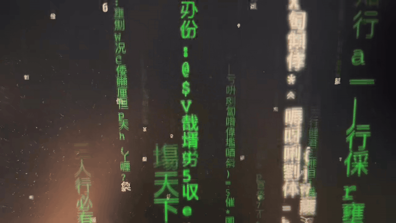

# Matrix Code Rain Screensaver for macOS


> **🚀 This is a Vibe Coding project**
>
> This project is purely vibe-driven, chasing the ultimate visual atmosphere. Feel free to fork this repo, inject your own creativity, and keep the vibe coding going!
>
> [中文文档 (Chinese Documentation)](./README_CN.md)

---

## 🎬 Demo

<p align="center">
  <a href="https://github.com/TonyGao/Matrix-Code-Rain-ScreenSaver/raw/main/demo.mp4">
    
  </a>
</p>

GitHub does not render inline videos in README. Use the link above to preview or download.

An advanced Matrix digital rain screensaver for macOS. It features multi-layered depth, Chinese classics integration, random AI quotes, and "glitch" streams.

---

## 💻 System Requirements

- **OS Version**: macOS 11.0 (Big Sur) or later
- **Architecture**: Supports both Intel and Apple Silicon (Universal Binary)

---

## ✨ Key Features

- **📺 Multi-Layer Depth**: 5 layers of code streams with different scales and speeds, creating a realistic sense of space.
- **📜 Chinese Classics Integration**: Famous lines from *Tao Te Ching*, *The Analects*, and Tang/Song poetry appear randomly, rendered top-to-bottom for coherent reading.
- **🔴 Glitch Streams**: 5% chance of red "glitch" streams that fall faster for a more dynamic visual impact.
- **🧩 Periodic Mosaic/AI Quotes**: Every 15-30 seconds, the rain converges into sci-fi inspired quotes (e.g., "The spoon does not exist", "System about to crash").
- **🔠 Mixed Characters**: A seamless blend of ASCII characters and common Chinese characters.
- **⚡️ High Performance**: Built with native Objective-C and Cocoa framework, running smoothly at 60 FPS with low CPU usage.
- **📏 Smart Layout**: Automatically adapts to different screen resolutions with text wrapping and auto-scaling.

---

## 🚀 Quick Installation

### Method 1: Download from Releases (Recommended)

1. Go to the [Releases](https://github.com/TonyGao/Matrix-Code-Rain-ScreenSaver/releases) page.
2. Download the latest `Matrix Code Rain.saver.zip` file.
3. Unzip the file, then double-click `Matrix Code Rain.saver`. The system will prompt you to install.
4. Select "Matrix Code Rain" in **System Settings** -> **Screen Saver**.

> **Note**: If the Releases page is empty, please use **Method 2** to build from source.

### Method 2: One-Click Installation Script (Build from Source)

If you have Xcode installed, you can build and install in one step:

```bash
git clone https://github.com/TonyGao/Matrix-Code-Rain-ScreenSaver.git
cd Matrix-Code-Rain-ScreenSaver
chmod +x install_and_refresh.sh
./install_and_refresh.sh
```

---

## 🛠 Development & Build

### Requirements

- macOS 11.0 or later
- Xcode 12.0 or later

### Build Steps

1. Clone the repository:

   ```bash
   git clone https://github.com/TonyGao/Matrix-Code-Rain-ScreenSaver.git
   cd Matrix-Code-Rain-ScreenSaver
   ```

2. Open `Matrix Code Rain/Matrix Code Rain.xcodeproj` with Xcode.
3. Select the `Matrix Code Rain` scheme and target `My Mac`.
4. Press `Cmd + B` to build.
5. The build output will be automatically synced to the `bin` folder in the project root.

---

## 📝 Customization

You can easily customize the following in `Matrix_Code_RainView.m`:

- **Poem List**: Modify the `poems` array in the `randomPoem` function.
- **AI Quote List**: Modify the `aiQuotes` array in the `initializeMatrix` function.
- **Speed & Density**: Adjust the speed logic in the `MatrixStream` class.

---

## 📄 License

This project is licensed under the [MIT License](LICENSE).

---

## 🤝 Contributing

Issues and Pull Requests are welcome to improve this project!

---

## ❤️ Acknowledgements

- Inspired by the movie *The Matrix*.
- Thanks to all developers contributing to the open-source community.

---

*Made with ❤️ by [Tony Gao](https://github.com/TonyGao)*
